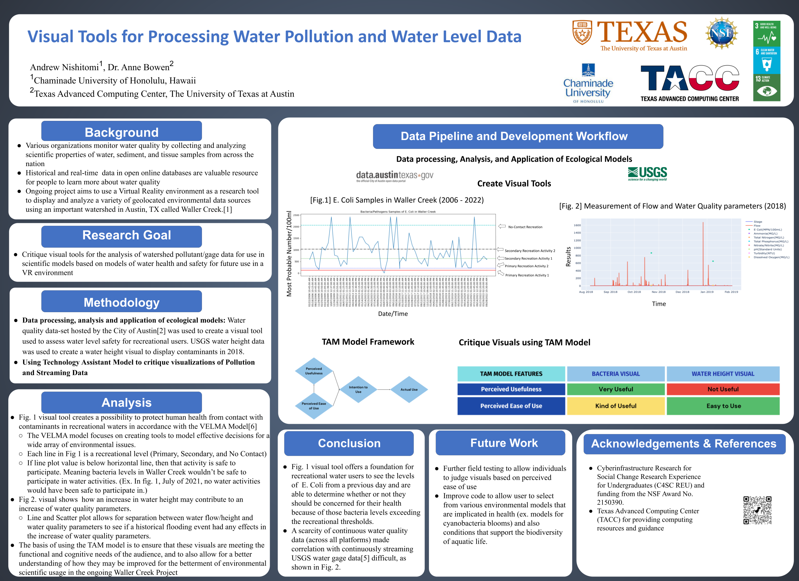

# DS495 - Data Science Directed Research 📊 📈 💻    
 This is a class for my program where I am required to create a "Research Driven" project. For this specific project, I will be using a pre-existing project that is finished and extending it. 

### Sustainable Development Goals
 
 
     
 
 # Project Description 🚰 🌎     
Various federal, state and local organizations monitor water quality by collecting and analyzing chemical, physical, and biological properties of water, sediment, and tissue samples from across the 
Nation. Historical and streaming data is hosted in open online databases and are a valuable resource for citizens and researchers to learn more about water. There is an ongoing project which aims to 
use a VR environment as a research tool to display and analyze a variety of geolocated environmental data sources using an important watershed in Austin, TX called Waller Creek. This project will    focused on developing visual tools for analyzing bacterial load in the water and any correlations with rainfall and water levels. As the project progresses, the scope will expand to encompass a  broader analysis, incorporating an analysis of historical and current water levels (rainfall)  and other data sources (such as USGS gage height)  from Waller Creek. The proposed visual tools, 
developed using the Python programming language, serves as the backbone for conducting geolocated collection frequency analyses. After creating the visual tools, the proposed methodology is to ensure 
that these visuals can be useful not only for the scientific community, but also the general public. Therefore, the implementation of critiquing these visual tools using the Techonology Acceptance 
Model (TAM) This infrastructure opens up new possibilities for researchers to investigate water quality in diverse watersheds across the nation presenting a valuable contribution to the scientific 
community’s understanding of water quality and water levels. Integrating these diverse research data sources offers a holistic understanding of the intricate relationship between the water and the 
aquatic life within Waller Creek. Ultimately, the fusion of technology and environmental science exemplified by this project holds promise for driving advancements in water quality and gage height 
analysis.     

# Poster  
     

# Programming Languages Used 

